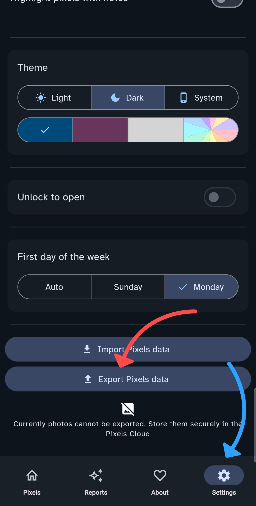

# How to Import Your Year In Pixels Backup

Pixels Memories allows you to use your existing data from the [Year In Pixels](https://teovogel.me/pixels/) app.  
Follow the steps below to export your data from Year In Pixels and import it into Pixels Memories.

## 1. Export Your Year In Pixels Data

1. Open the [Pixels](https://teovogel.me/pixels/) app (if you don’t have it, see notes below).  
2. Go to Settings and scroll down.  
3. Select 'Export Pixels Data'.  
4. Choose the location to save the backup file (`.json`) on your device.  

<p align="center">
  
</p>

---

## 2. Import the Backup into Pixels Memories

1. Open Pixels Memories.  
2. Go to the Settings screen.  
3. Select Import backup.  
4. Choose the `.json` file you exported from Year In Pixels.  

The app will process the file and load your past Pixels data locally.  

## 3. Use Pixels Memories

- Once the data is imported, Pixels Memories will send you daily notifications based on your past Pixels.  
- You can customize the behavior in the Settings:  
  - Notification time  
  - Maximum number of notifications per day  
  - Minimum pixel value to trigger a notification  

## Notes

- All data stays on your device (see [Privacy Policy](PRIVACY.md)).  
- You can import new backups at any time if your Pixels data changes.  
- If you don’t use the Year In Pixels app, you can still import your data into Pixels Memories. To do so, you must create a `.json` file following this structure (or build a converter that generates it):

```json
[
    {
        "date": "2025-1-1",
        "type": "Mood",
        "scores": [
            2,
            5
        ],
        "notes": "I feel great today!\nGreat weather.",
        "tags": [
            {
                "type": "Emotions",
                "entries": [
                    "happy",
                    "excited"
                ]
            }
            // other tags
        ]
    }
]